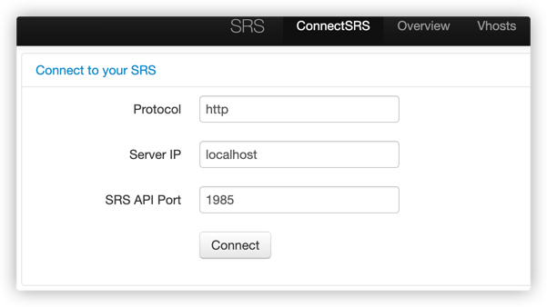

# Deploying SRS Server

```shell
// 1935 is the commonly used port for RTMP, 1985 is the API interface port, 8080 is the default control console access port. Here, I map it to the host 8085 port.
docker run -d --name srs -p 1935:1935 -p 1985:1985 -p 8085:8080 ossrs/srs:5.0.30

// Copy the configuration file from the container to the /home/srs5 directory on the host.
docker cp -a srs:/usr/local/srs/conf /home/srs5/

// Remove the old container.
docker rm -f srs

// Temporary variable, the IP of the current server. If it is a public server, it is the public IP. Used for transmitting WebRTC UDP packets.
CANDIDATE="192.168.1.101"
docker run --restart=always -d -v /home/srs5/conf/:/usr/local/srs/conf/ -p 1935:1935 -p 1985:1985 -p 8085:8080 \
    --env CANDIDATE=$CANDIDATE -p 8000:8000/udp \
    ossrs/srs:5.0.30 ./objs/srs -c conf/docker.conf
```


After successful startup, access ip:8085 to enter the SRS control console and change the port to 1985.


# Modify related IP addresses to the IP of the local server

```tsx
const serverSocketUrl = process.env.NODE_ENV === 'development' ? 'ws://127.0.0.1:18080' : server;
const srsServerAPIURL = 'http://192.168.1.101:1985/';
const srsServerRTCURL = 'webrtc://192.168.1.101:8085/live/';
const srsServerFlvURL = 'http://192.168.1.101:8085/live/';
```


# Start Redis Server
1. Start Redis Server on the local machine (server).
2. Open the node redis client of this project.

```shell
cd server/socket-server
npm install
npm run start
```

# Possible Bugs
## Cross-origin problem
If there is a cross-origin problem on port 3000, check if the Chrome server restricts camera/microphone permissions. (In the future, a secure HTTPS server should be established to pass browser security checks.) If the server IP (public IP) cannot connect to the SRS server, use localhost for testing.