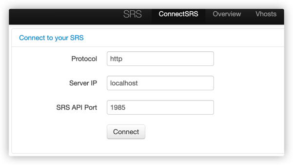

# 【基础】使用的协议

## RTMP

Real-Time Messaging Protocol，简称`RTMP`，是一种支持实时在线视频流的数据传输技术，最初是用在流媒体服务和 [Flash播放器](https://link.juejin.cn/?target=https%3A%2F%2Fen.wikipedia.org%2Fwiki%2FAdobe_Flash_Player) 之间传输多媒体流的。因此以前在浏览器中，只要有 Flash 播放器插件，就可以直接在线播放媒体流。然而在2021年左右，谷歌、微软等几大厂商集体做出决策（漏洞安全问题、封闭性、性能等多种因素），正式弃用。在谷歌浏览器 88 版本之后也将 Flash player 正式删除。

现在我们网页端是没法直接播放`RTMP`的，如果想要播放就必须转换成浏览器中播放器支持的流类型播放，比如：mp4、flv、hls等。

在实际使用场景中我们会用到`RTMP`的两种传输方式：推送和拉取，即：你可以将自己的视频通过`RTMP`推送到流媒体服务器和从流媒体拉取对应的流。

常用端口：1935。

## RTSP

Real Time Streaming Protocol ，简称 `RTSP`，它本身不会传输媒体流，而是充当客户端和与媒体服务端之间的控制通信，和`RTP`、`RTCP` 协议搭配，用于媒体流的传输。


## RTP

全称：Realtime transport protocol，真正意义上的数据传输协议，数据包构成包含版本号、填充位、标记位、有效荷载类型（这里就是标识不同类型媒体的，比如 H.264 视频、G.711 音频等）、序列号、时间戳等，具体详细解释可以看[这里](https://link.juejin.cn/?target=https%3A%2F%2Fzh.m.wikipedia.org%2Fzh-hans%2F%E5%AE%9E%E6%97%B6%E4%BC%A0%E8%BE%93%E5%8D%8F%E8%AE%AE)。

我们只需要知道，RTP 包传输的就是我们音视频会话过程中所需要的流量，当然发送的底层协议还是通过 UDP，因此在前面的数据包构成中，我们可以看到序列号、时间戳参数，目的就是让接收端可以自定义缓冲区，用于乱序纠正或者音画同步。

## RTCP

全称：Real-time Transport Control Protocol 或 RTP Control Protocol ，或简写 RTCP，是 RTP 的姊妹协议，RTCP 本身并不传输数据，但和上面提到的 RTP 一起协作将媒体数据打包和发送。RTCP 收集相关媒体连接的统计信息，例如：传输字节数、网络状态、丢包状况、单向和双向网络延迟等等，这样可以控制服务质量，诊断网络状况。

我们的课程的主题，WebRTC 实现的会议系统通话过程中数据包的检测、反馈，都是通过这个协议。


# 部署SRS服务器

```shell
// 1935 RTMP的常用端口  1985 API接口端口  8080默认控制台访问端口 在这里我映射到宿主机8085端口 docker run -d --name srs -p 1935:1935 -p 1985:1985 -p 8085:8080 ossrs/srs:5.0.30

// 从容器中拷贝配置文件到宿主机的 /home/srs5 目录
docker cp -a srs:/usr/local/srs/conf /home/srs5/

// 移除旧容器
docker rm -f srs

//临时变量，当前服务器的IP，如果是公网服务器的话则为公网IP 用户webrtc UDP 包的传输
CANDIDATE="192.168.1.101"
docker run --restart=always -d -v /home/srs5/conf/:/usr/local/srs/conf/ -p 1935:1935 -p 1985:1985 -p 8085:8080 \
    --env CANDIDATE=$CANDIDATE -p 8000:8000/udp \
    ossrs/srs:5.0.30 ./objs/srs -c conf/docker.conf
```


启动成功后，访问ip:8085，进入SRS控制台，将端口改为1985。看到这个页面说明启动成功。



# 修改相关ip地址为本机服务器ip

```tsx
const serverSocketUrl = process.env.NODE_ENV === 'development' ? 'ws://127.0.0.1:18080' : server;
const srsServerAPIURL = 'http://192.168.1.101:1985/';
const srsServerRTCURL = 'webrtc://192.168.1.101:8085/live/';
const srsServerFlvURL = 'http://192.168.1.101:8085/live/';
```


# 启动Redis Server
1. 启动本机（服务器）的Redis Server 
2. 开启本项目的node redis客户端

```shell
cd server/socket-server
npm install
npm run start
```

# 可能存在的Bug
## 跨域问题
如果是3000端口出现跨域问题，检查Chrome服务器是否限制了摄像头/话筒权限（后续应建立安全的HTTPS服务器以通过浏览器安全检查），如果服务器IP（公网IP）无法连上SRS服务器，使用localhost测试。


